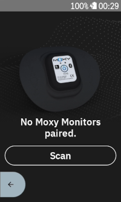
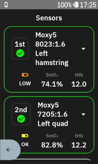
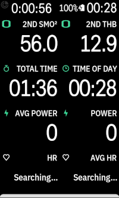

# Karoo MoxyMonitor Extension

Karoo extension that provides data fields for muscle oxygen saturation (SMO2) and total hemoglobin (THb)
from Moxy Monitor devices.

Compatible with Karoo 2 and Karoo 3 devices.

## Installation

If you are using a Karoo 3, you can use [Hammerhead's sideloading procedure](https://support.hammerhead.io/hc/en-us/articles/31576497036827-Companion-App-Sideloading) to install the app:

1. Using the browser on your phone, long-press [this download link](https://github.com/Moxy-Monitor/moxy-karoo-extension/releases/latest/download/app-release.apk) and share it with the Hammerhead Companion app.
2. Your karoo should show an info screen about the app now. Press "Install".
3. Set up your data fields as desired.

If you are using a Karoo 2, you can use manual sideloading:

1. Download the apk from the [releases page](https://github.com/Moxy-Monitor/moxy-karoo-extension/releases) (or build it from source)
2. Set up your Karoo for sideloading. DC Rainmaker has a great [step-by-step guide](https://www.dcrainmaker.com/2021/02/how-to-sideload-android-apps-on-your-hammerhead-karoo-1-karoo-2.html).
3. Install the app by running `adb install app-release.apk`.
4. Set up your data fields as desired.

## Usage

After installation, pair your moxy monitor devices with your Karoo by initiating a sensor scan.
You can pair up to 4 devices.

You can then add the data fields for SMO2 and THb to your data screens.

In the extension settings, you can set a sensor location for each moxy monitor, which will be
included in the FIT file recording.

## Links

[moxymonitor.com](https://moxymonitor.com/)

[karoo-ext source](https://github.com/hammerheadnav/karoo-ext)
